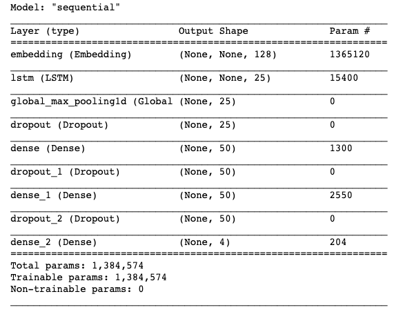
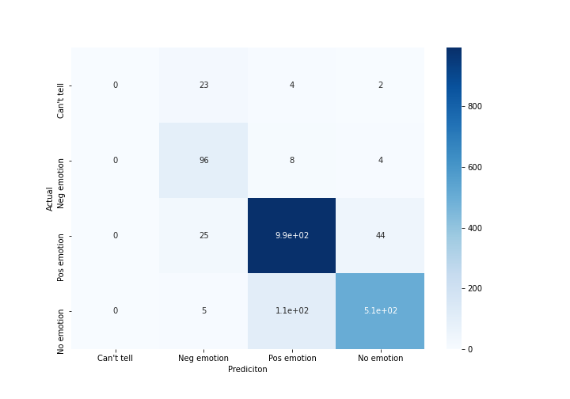

# Twitter Sentiment Evaluator

</img>

### Background
This was an optional project from the curriculm I have been working through.  (I am interested in doing more NLP)

Goal is to build an NLP model to analyze Twitter sentiment about Apple and Google products. The dataset comes from CrowdFlower via data.world. Human raters rated the sentiment in over 9,000 Tweets as positive, negative, or neither.

The intention is to build a model that can rate the sentiment of a Tweet based on its content.  (Aim is for a Proof of Concept)

I started this project by completing a sequence of Deep NLP lessons from Flatiron School in the appendix of Module 4
This included:
- Word embeddings
- Word2vec
- Sequence Models
- Recurrant Neural Networks (RNN)
- LSTM (Long Short term Membory) and GRU (Gated Recurrant Unit)

The relevant code for this project will be in this **sentiment.ipnyb** notebook.

# Supervised models

## Preprocessing
**Our Data**
The tweets from Crowdflower are in this repository as a csv.  

The target for our classification will be the emotion as labeled. (No emotion, Positive, Negative, Can't tell)
The tweet text is our data set, and we  was then tokenized using nltk.  

**Glove vector model**
A pretrained vector model (GloVe 200) was used.  I took the 200 vector one from kaggle instead of the larger ones from the Stanford NLP Group.  The glove vectors were extracted from the text file and converted to a numpy array.

## Create our models
**Create mean word embeddings**
We set up pipleines using scikit-learn to save time and make the code cleaner.  We created word vector objects suitable for the pipline, and passed in the different classification models.  

**Models used**
We tried Random Forest Classifier, SVC, and Logistic Regression without tuning hyperparameters for a baseline score.
We used cross validation as the scoring method.

# Deep Learning
We used a Recurrant Neural Network (RNN) as the unsupervised ML for this project.  It is a Sequential keras model with an LSTM layer, and Dense and Dropout layers. 

## Preprocessing
We use one hot encoding of the target (emotion) for each of the 4 possible outcomes.

Again, we use tokenize.  This time with keras tokenizer.  Tweets are converted to sequences and padded so they are all same length.

The data is split 80/20.  

## Recurrant Neural Network

The neural network is set up as:

</img>

The model is compiled and fit (10 epochs were used)

# Results

The RNN ouperformed the supervised models with the confusion matrix below (test set)  

</img>

The confusion matrix shows that there were very few tweets graded as negative.  The neural network doesn't predict any negatives due to the small number.

More than half are positive emotions, and rest is split between 'can't tell' and 'no emotion'.  

The model predicts at around 87% accuracy against the test set.  The base supervised modesl (untuned) only scored around 60% by comparison.  The RNN is well suited for this task and can be further tuned or trained (perhaps using larger GloVe vectors). 

A larger dataset, or perhaps a dataset with more negative labels might help train the model to make predictions at a higher rate.  

